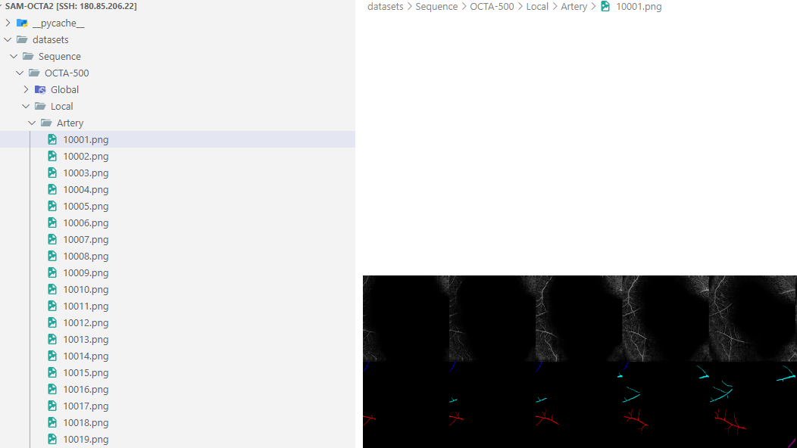
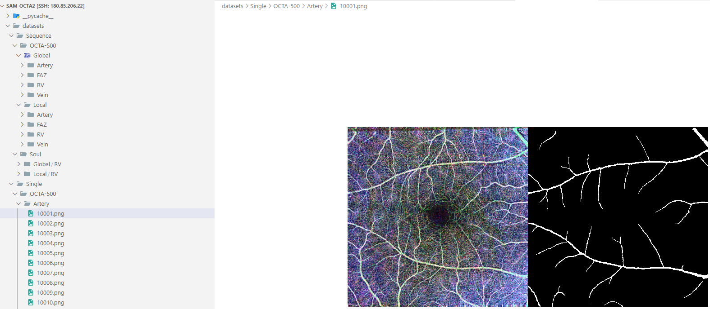
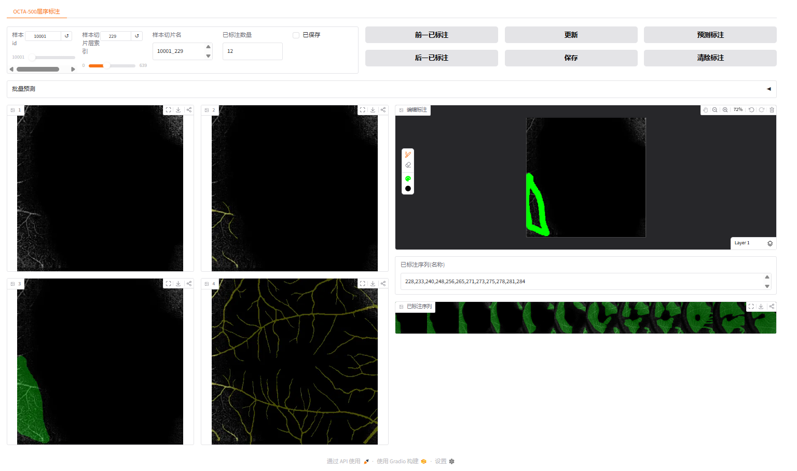

# SAM-OCTA2

中文版README: [README_zh](./README_zh.md)

## 1. Introduction

__SAM-OCTA2__ is an extended segmentation method based on __SAM-OCTA__ designed for sequential scanning. Since __OCTA__ and many other types of medical image samples are formed by stacking sequential scans and can be essentially viewed as three-dimensional, they formally correspond to video object segmentation.

Due to the need for a journal paper submission, I have refactored parts of the code, especially the fine-tuning section. In summary, this significantly saves GPU memory (VRAM). Simply put, the storage of gradient maps for the backbone network has been eliminated. Consequently, this now supports the fine-tuning of __large__ size models. Through this refactoring, not only has performance improved substantially, but usability has also been greatly enhanced. However, the more VRAM the better. I’m using an 80GB A100.

First, you should place a pre-trained weight file into the __pretrained_weights__ folder. The download links for pre-trained weights are as follows:

large (default): https://dl.fbaipublicfiles.com/segment_anything_2/072824/sam2_hiera_large.pt

base_plus: https://dl.fbaipublicfiles.com/segment_anything_2/072824/sam2_hiera_base_plus.pt

small: https://dl.fbaipublicfiles.com/segment_anything_2/072824/sam2_hiera_small.pt

tiny: https://dl.fbaipublicfiles.com/segment_anything_2/072824/sam2_hiera_tiny.pt

__large__ is used by default. If you need to use models of other sizes, please download the corresponding weights and modify the configuration in __options.py__:

    ...
    parser.add_argument("-model_type", type=str, default="large")
    ...

## 2. About Fine-tuning

Use __train_sam_octa2.py__ to start fine-tuning.

    python train_sam_octa2.py

Here, I used a few samples from the __OCTA-500__, __ROSE__, and __Soul__ datasets as examples. If you require the full datasets, please contact their respective authors.

__OCTA-500__ related paper: https://arxiv.org/abs/2012.07261

__ROSE__ related paper: https://ieeexplore.ieee.org/document/9284503

__Soul__ related paper: https://www.nature.com/articles/s41597-024-03665-7

Dataset paths need to be placed according to the task type:

Segmentation types are categorized into sequence and single-image (en-face projection segmentation). Before fine-tuning, you need to configure and confirm the type in the __options.py__ file.

    ...
    parser.add_argument("--dataset", type=str, default="3M")
    parser.add_argument("--data_type", type=str, default="sequence") 
    parser.add_argument("--label_type", type=str, default="Artery")
    parser.add_argument("--is_local", type=str, default="Local")
    ...

Example results and segmentation metrics will be recorded in the __results__ folder (if it does not exist, it will be automatically created).

Note that the journal version has undergone some modifications compared to the conference version. Only positive prompts are used (as negative prompts have limited effect). The over-reliance on prompt points for single-image (en-face projection) segmentation has been reduced, enhancing its practicality and making it closer to an end-to-end model.

## 3. Sparse Annotation

The purpose of sparse annotation is to utilize existing mature segmentation models (e.g., DiNTS) to perform auxiliary sequential annotation on the __OCTA-500__ dataset. The code for training and the Gradio frontend for manual annotation/prediction are as follows:

Training: __sparse_annotation_train.py__

Frontend manual annotation/prediction: __sparse_annotation_predict.py__

Regarding the model training part for sparse annotation, the processing of vessel regions for the OCTA-500 dataset may not be strictly necessary; its value lies more in the workflow, which can serve as a reference for improvements.

First, you need to manually specify the path for the volumetric data. In my implementation, sequential images are stacked into `.npy` files and placed under the path __datasets/Sparse/OCTA-500/sample__. The annotated images are stored in the path __datasets/Sparse/OCTA-500/sam2_region__, waiting to be read and trained by the DiNTS model.

After manually annotating some samples, you can train using the DiNTS model, with weights saved at __pretrained_weights/dints_region.pth__. Then, return to the __gradio__ annotation interface to predict and edit the remaining samples.

I have placed the sparse annotation samples in Baidu Netdisk. More weight data will likely be placed in this folder in the future:

Link: https://pan.baidu.com/s/1hZAWdUC5vm3SngudR5n6gw?pwd=jdxb  Extraction code: jdxb

## 4. Segmentation Effect Preview

__Sequence__

_RV_
 

_FAZ_
 

__En-face Projection__

_RV_
 

_FAZ_
 

## 5. Others

If you find this useful, please cite the related paper (Conference Version): https://ieeexplore.ieee.org/abstract/document/10888853