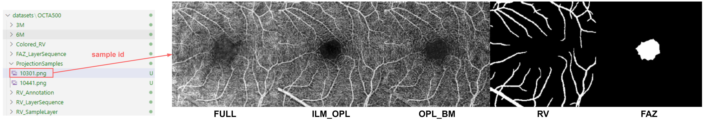

# SAM-OCTA2

中文版README: [README_zh](./README_zh.md)

## 1. Before You Start 

__SAM-OCTA2__ is an extended segmentation method for __SAM-OCTA__ in layer-sequential scanning, as __OCTA__ and many other types of medical imaging samples are essentially stacked after layer-sequential scanning, making them inherently 3D. Thus, in form, it can correspond to object segmentation in videos.

__Note__: The memory required for this training is quite large, and I basically maxed out the A100's 80GB when the frame length is set to 8. Testing should be less demanding (but still requires preparation, hmm).

This project can be divided into two main parts: fine-tuning SAM-OCTA2 and processing the specific data modality of OCTA. Honestly, due to the considerable workload, I was quite busy, so I didn’t carefully summarize how to set up the environment and dependencies. I suggest running the key files and using the warnings to install the necessary packages via pip.

First, you should place a pre-trained weight file into the __sam2_weights__ folder. The download links for the pre-trained weights are as follows:

base_plus (default): https://dl.fbaipublicfiles.com/segment_anything_2/072824/sam2_hiera_base_plus.pt

large: https://dl.fbaipublicfiles.com/segment_anything_2/072824/sam2_hiera_large.pt

small: https://dl.fbaipublicfiles.com/segment_anything_2/072824/sam2_hiera_small.pt

tiny: https://dl.fbaipublicfiles.com/segment_anything_2/072824/sam2_hiera_tiny.pt

__base_plus__  is the default model. If you want to use another size, please download the corresponding weights and modify the configuration in __options.py__:

    ...
    parser.add_argument("-model_type", type=str, default="base_plus")
    ...

## 2. About Fine-tuning

Use __train_sam_octa2.py__ to start fine-tuning:

    python train_sam_octa2.py

I used a few samples from __OCTA-500__ as an example. If you need the complete dataset, you’ll need to contact the authors of the __OCTA-500__ dataset.

Relevant __OCTA-500__ paper: https://arxiv.org/abs/2012.07261

Place the original OCTA-500 dataset in this path:

### 2.1. Layer-sequential segmentation:

__RV (clusters)__:

The images and annotations of the RV samples are separated, as each vessel must be assigned first. The same vessel may be split into two parts by the layer cuts. The annotation path is configured as shown, and the annotation files in this folder are generated by the __mark_rv_objects__ method in __utils.py__.

The sample path configuration is shown below. The useful images are the last two, while the first one is the mask of the vessel region.

__FAZ__:

The FAZ sample configuration path is shown below. The layer images are formed by combining three images. The useful images are the last two, while the first one is only for preview and is not used by the model in this project.

The sample results and segmentation metrics will be recorded in the __results__ folder (if it doesn’t exist, the folder will be automatically created).

Here are some examples of segmentation with prompt points. From left to right are the input image, annotation, and predicted result.

### 2.2 En-face projection segmentation

For the common en-face projection segmentation task, SAM-OCTA2 can also be used, but it requires re-fine-tuning. The sample path configuration is shown below. I have combined all the images used into one for preview.

## 3. Sparse annotation

The goal of sparse annotation is to use mature segmentation models to assist in annotation. The training and prediction codes are as follows:

__sparse_annotation_rv_training.py__ and __sparse_annotation_rv_prediction.py__

The path and naming rules for the training dataset are shown below:

The layer-sequential images to be predicted are placed in this path:

## 4. Segmentation Results Preview 

__Layer-sequential__

_RV_
 

_FAZ_
 

__En-face Projection__

_RV_
 

_FAZ_
 

## 5.Others 

<!-- If you find this useful, please cite the relevant paper: https://arxiv.org/abs/2309.11758 -->

__Additional notes__： The current paper is under review for conference submission, so more detailed weights and content will be released and added after acceptance.