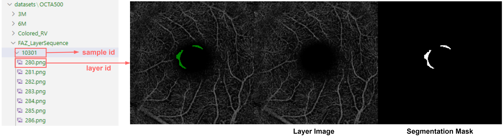

# SAM-OCTA2

## 1. 写在开头

__SAM-OCTA2__ 是关于 __SAM-OCTA__ 在层序扫描下的拓展分割方法，因为 __OCTA__ 以及其他很多类型的医学图像样本是通过层序扫描后堆叠起来的，本质上可视作三维的, 所以形式上是可以和视频的目标分割相对应。

__注意__：这次的训练所需的显存相当大，我在把序列长度设置为8帧的时候，基本上是把A100的80G都跑满了，如果只是测试应该会宽松一些（总之需要有一定准备，，嗯）。

这里我想稍微废话几句自己对于三维数据的标注的看法。首先这很难通过使用例如 __Blender__ 这样的三维软件直接标注，尽管这种方法可以有很直观的可视化效果，通过不同视角的反复比对可以达到相当的精度。目前很多方法使用的就是层序标注，无论如何，纯粹的人工标注也会有相当大的工作量

本项目的工作总体而言可分为两个部分，是对于 SAM-OCTA2 的微调以及关于OCTA这一特殊数据模态的处理。实话说，由于工作量属实不小，前后弄完已经比较忙乱，所以我也没有去好好总结应该如何去装环境和依赖，建议把几个主要的文件跑一下，根据警告来pip install。

首先，您应该将一个预训练的权重文件放入 **sam2_weights** 文件夹中。预训练权重的下载链接如下:

base_plus (default): https://dl.fbaipublicfiles.com/segment_anything_2/072824/sam2_hiera_base_plus.pt

large: https://dl.fbaipublicfiles.com/segment_anything_2/072824/sam2_hiera_large.pt

small: https://dl.fbaipublicfiles.com/segment_anything_2/072824/sam2_hiera_small.pt

tiny: https://dl.fbaipublicfiles.com/segment_anything_2/072824/sam2_hiera_tiny.pt

__base_plus__ 是默认使用的，如果您需要使用其他尺寸的模型，请下载对应权重，并在 __options.py__ 中修改对应配置项：

    ...
    parser.add_argument("-model_type", type=str, default="base_plus")
    ...

## 2. 关于微调

使用 **train_sam_octa2.py** 来开始进行微调。

    python train_sam_octa2.py

这里我使用了 __OCTA-500__ 中的几个样本作为一个示例，如果需要完整的数据集，需要联系 __OCTA-500__ 数据集的作者。

__OCTA-500__ 的相关论文: https://arxiv.org/abs/2012.07261

首先将OCTA-500原有的数据集按照这个路径原样放置：

### 2.1. 层序分割

__RV__（视网膜血管（簇））:

RV样本的图像和标注是分开的，原因是要先标记出每根血管所属，图像中的同一根血管可能因为层切分拆为两部分。标注的路径配置如下，这个文件夹的标注文件是经过 __utils.py__ 中的 __mark_rv_objects__ 方法得到的。

样本路径配置如图，有用的是后两张图，前面的是血管区域的mask。

__FAZ__（中心无血管区）:

FAZ样本配置的路径如图，层图像样本是将三张图拼接在一起的。有用的图像是后两张，第一张只是用来看预览效果的，本项目中并没有被模型使用。

示例结果和分割指标将被记录在 **results** 文件夹中（如果不存在，则这个文件夹将被自动创建）。

这是一些带有提示点的分割的示例，从左到右分别是输入图像、标注以及预测结果。

### 2.2 en-face 投影分割

对于常见的en-face投影分割任务，SAM-OCTA2也可完成，但是需要重新微调，样本路径配置如图。这里我将所有的用到的图像并排合成为一张，以便预览。

## 3. 稀疏标注

稀疏标注的目的是利用现有成熟的分割模型辅助标注，训练代码和预测代码：

__sparse_annotation_rv_training.py__ 和 __sparse_annotation_rv_prediction.py__

训练数据集的路径和命名规则如图所示：

需要预测的层序图像放在这个路径：

## 4. 分割效果预览

__层序__

_RV_
 

_FAZ_
 

__en-face 投影__

_RV_
 

_FAZ_
 

## 5.其他

<!-- 如果觉得有用请引用相关论文: https://arxiv.org/abs/2309.11758 -->

__另外的说明__： 当前的论文正在投稿会议审稿中，因此更详细的权重或内容将在中稿后公布和增加。